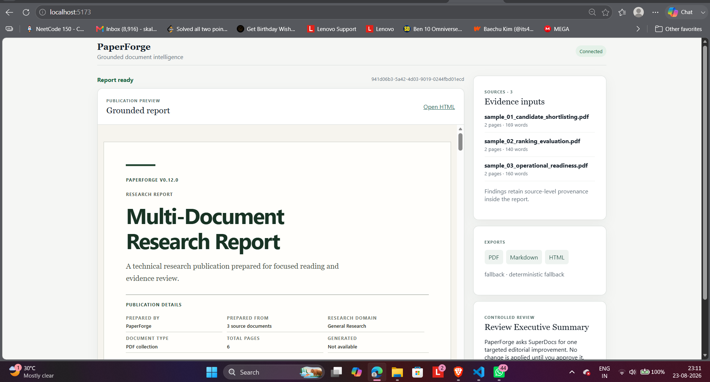
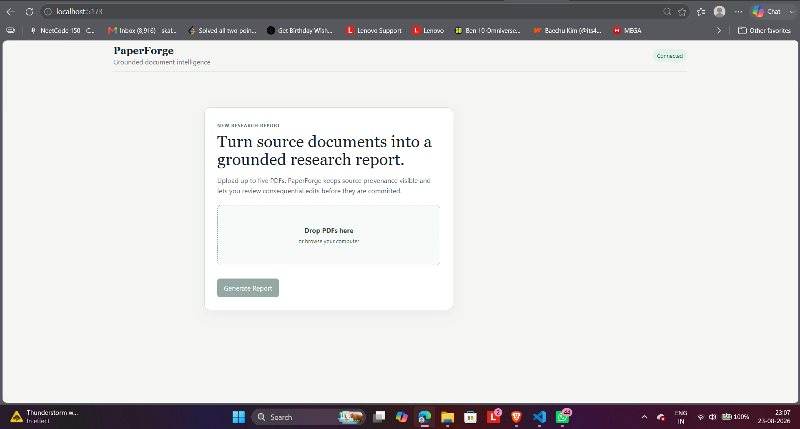
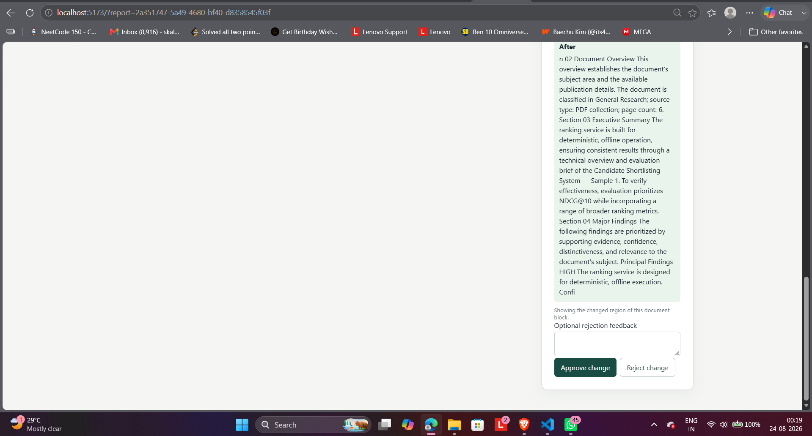

# PaperForge

> PaperForge turns source PDFs into evidence-grounded research reports with traceable provenance and human-approved document edits.

PaperForge is a document-intelligence workflow for research that needs to remain inspectable. It accepts one PDF or an ordered set of two to five PDFs, builds a structured report from grounded source evidence, and preserves source identity through the publication view. Consequential editorial changes are then proposed through SuperDocs, shown as exact before/after text, and applied only after an explicit human decision.

The product story is simple: **source documents → grounded synthesis → traceable report → precise edit → human review → verified commit**.



## Why PaperForge

AI can make a useful summary quickly, but a useful research workflow needs more than fluent prose. Readers need to know which source supports a finding, and document changes that affect a published artifact need visible scope and human control.

PaperForge treats the report as a grounded, persisted publication rather than a transient chat response. It keeps provenance visible in the report, preserves the canonical PaperForge artifacts during review, and requires an explicit approve or reject action before a proposed document edit can be committed.

## What it does

1. Upload one PDF or two to five ordered source PDFs.
2. Parse and chunk each source independently.
3. Extract structured knowledge and synthesize one grounded research report.
4. Inspect reader-facing findings with source labels such as `sample_02_ranking_evaluation.pdf · excerpt 1`.
5. Request one controlled Executive Summary editorial improvement.
6. Review the exact before/after proposal and explicitly approve or reject it.
7. Download a verified reviewed DOCX when the approved change is confirmed in the export.

## Demo workflow

A typical demonstrated flow is:

```text
3 PDFs
  → one multi-document report
  → source-aware findings and publication preview
  → Executive Summary review proposal
  → human approval
  → verified reviewed DOCX
```

The original JSON, Markdown, HTML, and PDF report artifacts remain available and unchanged throughout this review stage. The human-reviewed artifact in v0.12 is a DOCX, not a reviewed PDF.

## Architecture

```mermaid
flowchart LR
    A[1–5 source PDFs] --> B[Parser]
    B --> C[Independent chunking]
    C --> D[Knowledge extraction]
    D --> E[Research synthesis]
    E --> F[Document synthesis]
    F --> G[Report intelligence]
    G --> H[Immutable presentation model]
    H --> I[HTML / Markdown / PDF]
    I --> J[SuperDocs review]
    J --> K[Human approve / reject]
    K --> L[Verified reviewed DOCX]
    C -. filename + excerpt identity .-> H
```



The backend owns document processing, report persistence, and review orchestration. The React frontend consumes the existing API: it uploads PDFs, previews persisted report HTML in an iframe, displays source metadata, and presents the controlled review state. It does not recreate the report renderer or call Groq or SuperDocs directly from the browser.

## Key design decisions

### Preserve source boundaries

Multiple PDFs are not raw-concatenated into a pretend single document. Each source is parsed and chunked independently, with its original filename retained. This makes it possible for the final publication to identify supporting evidence by document and excerpt.

### Keep canonical reports immutable

The canonical report and its `PresentationModel` are generated and persisted before review. The review stage reads the persisted report HTML and operates in a separate SuperDocs session. It does not mutate `report.json`, regenerate the pipeline, or rewrite the canonical PaperForge report.

### Make provider failure safe

Malformed or unavailable model output follows existing deterministic fallback behavior rather than silently weakening validation. This keeps the report workflow available while preserving clear fallback metadata.

### Curate reader-facing evidence with provenance

Professional and executive presentation views use curated findings, retain source identifiers, and balance useful evidence across documents in multi-source reports. The report labels source support with real document/chunk identity rather than invented confidence claims.

### Place SuperDocs after report generation

SuperDocs is a controlled document-action layer, not part of canonical research synthesis. PaperForge sends the already persisted `report.html` to an `ask_every_time` review session for one bounded Executive Summary improvement.

### Require a human decision and verify the result

PaperForge never automatically approves a proposed edit. Each change is approved or rejected by its exact change ID. Once the provider job completes, PaperForge exports DOCX and inspects `word/document.xml` to verify that approved edit/create text exists, or that approved delete text is absent.

## Example provenance

```text
SUPPORTED BY
sample_02_ranking_evaluation.pdf · excerpt 1
```

These labels come from actual document filenames and chunk order. They let a reader follow a report finding back to its supporting source excerpt without exposing internal UUIDs in the publication.

## Human review

```text
Persisted PaperForge report.html
  → SuperDocs approval_mode=ask_every_time
  → proposed change
  → exact BEFORE / AFTER
  → explicit approve or reject
  → DOCX export
  → verification of approved text
```

The local `review.json` state holds only the small review record needed by the UI: status, pending changes, approved changes, rejected changes, and DOCX availability. It does not store API keys, authorization headers, provider stack traces, complete provider responses, or full report HTML.

If a browser reload occurs, the frontend restores a report from `?report=<report_id>` by reading persisted metadata and, if present, the local review state. Recovery is GET-only: it does not start a new SuperDocs job, poll SuperDocs from the browser, or infer approval.

## Product UI

The v0.12 React interface is intentionally a single focused workspace:

- Drag and drop or browse for up to five PDFs, preserving selected order.
- See a deterministic processing narrative while the synchronous report request runs.
- Read the persisted publication in an isolated report iframe.
- Inspect real source filenames, page counts, and word counts from report metadata.
- Open/download PDF, Markdown, and HTML artifacts without replacing the workspace.
- Start the controlled Executive Summary review and inspect a bounded readable text diff instead of a large raw HTML block.
- Approve or reject each pending proposal independently, with optional rejection feedback.
- Download the reviewed DOCX only after backend export and verification succeed.

Provider-supplied `old_html` and `new_html` are never injected into the React tree. The UI converts them to plain text with `DOMParser`, trims common prefix/suffix context, and displays a bounded changed region as text.





## API

| Method | Endpoint | Purpose |
| --- | --- | --- |
| `POST` | `/reports` | Upload one PDF and create a report. |
| `POST` | `/reports/multi` | Upload two to five ordered PDFs and create one report. |
| `GET` | `/reports/{report_id}` | Retrieve the persisted presentation model. |
| `GET` | `/reports/{report_id}/html` | Retrieve standalone report HTML. |
| `GET` | `/reports/{report_id}/pdf` | Retrieve the original publication PDF. |
| `GET` | `/reports/{report_id}/markdown` | Retrieve report Markdown. |
| `GET` | `/reports/{report_id}/metadata` | Retrieve source and generation metadata. |
| `POST` | `/reports/{report_id}/review` | Start or safely recover a controlled review. |
| `GET` | `/reports/{report_id}/review` | Retrieve persisted local review state only. |
| `POST` | `/reports/{report_id}/review/approve` | Approve one pending change. |
| `POST` | `/reports/{report_id}/review/reject` | Reject one pending change, optionally with feedback. |
| `GET` | `/reports/{report_id}/docx` | Retrieve a verified reviewed DOCX when available. |

Interactive API documentation is available locally at `http://127.0.0.1:8000/docs`.

## Tech stack

**Backend**

- Python, FastAPI, and Pydantic
- PyMuPDF for PDF extraction
- Groq for configured knowledge extraction and document synthesis
- Playwright for professional publication-style PDF rendering
- httpx for the narrow SuperDocs client
- Python standard-library ZIP/XML inspection for post-export DOCX verification

**Frontend**

- React, TypeScript, and Vite
- Native `fetch` with a narrow typed API client
- Vitest and React Testing Library

**Editing and review**

- SuperDocs API, with explicit per-change human approval

## Getting started

### Backend

From the repository root:

```bash
cd backend
python -m venv .venv
```

Activate the environment:

```powershell
# Windows PowerShell
.\.venv\Scripts\Activate.ps1
```

```bash
# macOS / Linux
source .venv/bin/activate
```

Install dependencies and Chromium for PDF rendering:

```bash
pip install -r requirements.txt
python -m playwright install chromium
```

Copy `.env.example` to `.env`, then configure `GROQ_API_KEY` for live report generation. Configure `SUPERDOCS_API_KEY` only when using the human-review workflow; the application starts normally without it, and only review functionality is unavailable.

Run the API:

```bash
uvicorn app.main:app --reload
```

### Frontend

In a second terminal:

```bash
cd frontend
npm install
```

Copy `.env.example` to `.env`, then run:

```bash
npm run dev
```

Default local URLs:

- Frontend: `http://localhost:5173`
- Backend: `http://127.0.0.1:8000`
- API docs: `http://127.0.0.1:8000/docs`

The frontend environment contains only `VITE_API_BASE_URL`. Do not place Groq or SuperDocs keys in Vite environment files.

## Configuration

### Backend

| Variable | Required | Purpose |
| --- | --- | --- |
| `GROQ_API_KEY` | For live generation | Groq API key. Keep secret. |
| `GROQ_MODEL` | No | Configured Groq model. |
| `SUPERDOCS_API_KEY` | For human review | SuperDocs API key. Keep secret. |
| `SUPERDOCS_API_BASE_URL` | No | SuperDocs API base URL. |
| `SUPERDOCS_POLL_INTERVAL_SECONDS` | No | Bounded review polling interval. |
| `SUPERDOCS_MAX_WAIT_SECONDS` | No | Bounded review polling duration. |
| `CORS_ORIGINS` | No | Comma-separated permitted local frontend origins. |
| `REPORT_STORAGE_DIR` | No | Local persisted-report directory. |
| `API_HOST` | No | FastAPI bind host. |
| `API_PORT` | No | FastAPI port. |
| `LOG_LEVEL` | No | Application log level. |

### Frontend

| Variable | Required | Purpose |
| --- | --- | --- |
| `VITE_API_BASE_URL` | No | PaperForge backend URL; defaults to local development API. |

## Testing

Backend tests:

```bash
cd backend
python -m pytest tests -q --basetemp .pytest-final
```

The verified backend suite currently has **264 passing tests**.

Frontend validation:

```bash
cd frontend
npm run typecheck
npm run test -- --run
npm run build
```

Frontend typecheck, tests, and production build pass locally.

## Release progression

- **v0.9** — API and resilient live pipeline
- **v0.10** — grounded multi-document reports
- **v0.11** — SuperDocs human review and verified DOCX export
- **v0.12** — demo-ready React product UI and URL-based workspace recovery

## Current scope

v0.12 intentionally focuses on the research-to-reviewed-document workflow. It does not currently include authentication, user accounts, database-backed multi-user history, background job infrastructure, billing, cloud deployment, arbitrary document chat, or reviewed PDF generation. These are deliberate scope boundaries, not claims of production deployment.

## Repository structure

```text
backend/
  app/
    api/
    chunking/
    integrations/
    models/
    reports/
    services/
  tests/

frontend/
  src/
    api/
    components/
    styles/
    utils/

docs/
examples/
```

## Final status

**v0.12.0 — demo-ready prototype.** The end-to-end workflow has been validated locally: source PDFs become a grounded report, source provenance remains visible, consequential edits require explicit human review, and the final reviewed DOCX is verified before it is offered for download.
